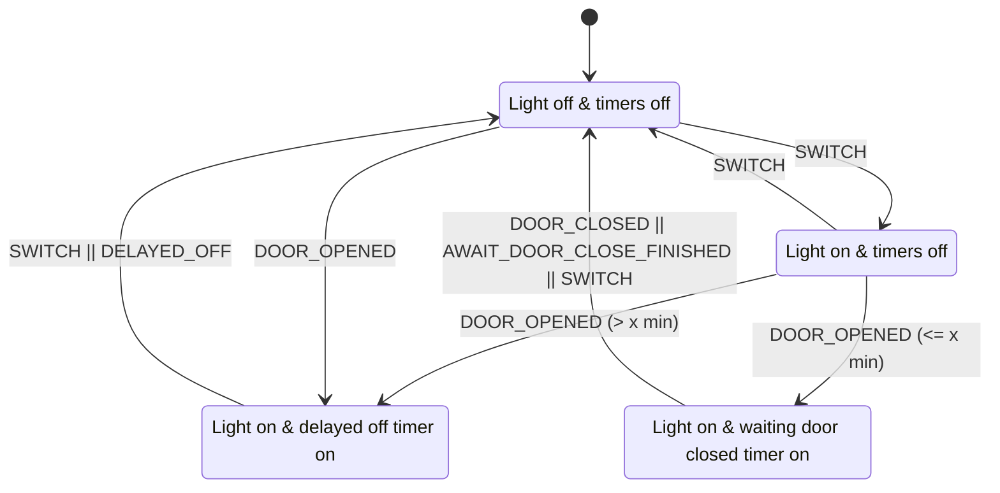

```mermaid
stateDiagram
    state "Light off & timers off" as OFF
    state "Light on & timers off" as ON
    state "Light on & delayed off timer on" as ON_AUTO_OFF
    state "Light on & waiting door closed timer on" as LEAVING_HOME
    
    [*] --> OFF
    ON --> OFF: SWITCH
    OFF --> ON: SWITCH

    ON --> ON_AUTO_OFF: DOOR_OPENED (> x min)

    OFF --> ON_AUTO_OFF: DOOR_OPENED
    ON_AUTO_OFF --> OFF: SWITCH || DELAYED_OFF

    ON --> LEAVING_HOME: DOOR_OPENED (<= x min)
    LEAVING_HOME --> OFF: DOOR_CLOSED || AWAIT_DOOR_CLOSE_FINISHED || SWITCH
```