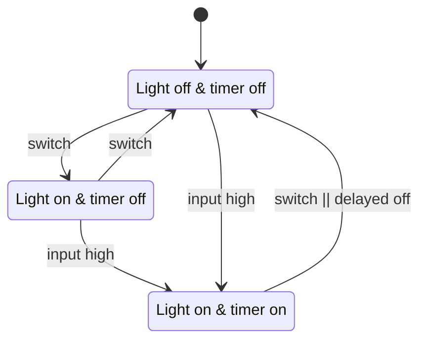

```mermaid
stateDiagram
    state "Light off & timer off" as OFF
    state "Light on & timer off" as ON
    state "Light on & timer on" as TIMER_ON
    
    [*] --> OFF
    ON --> OFF: switch
    OFF --> ON: switch

    ON --> TIMER_ON: input high

    OFF --> TIMER_ON: input high
    TIMER_ON --> OFF: switch || delayed off
```